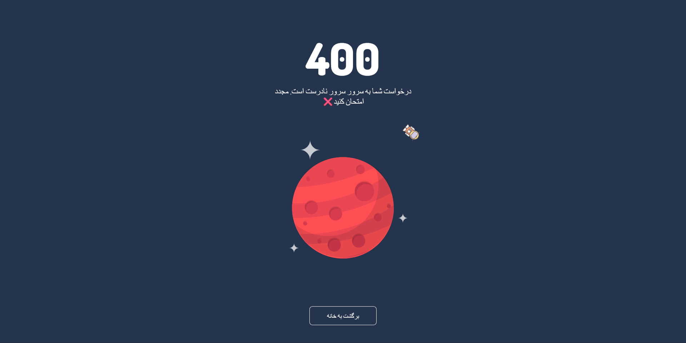
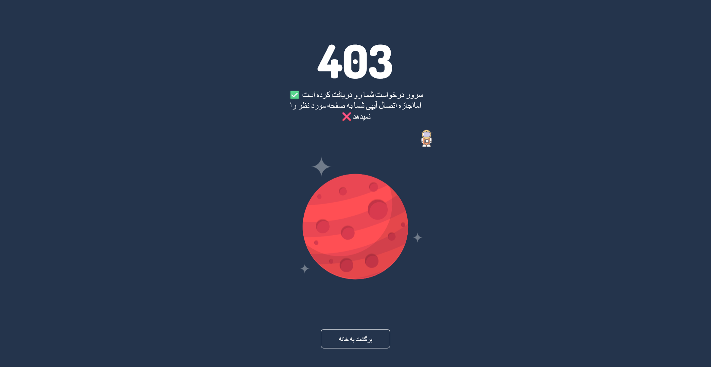
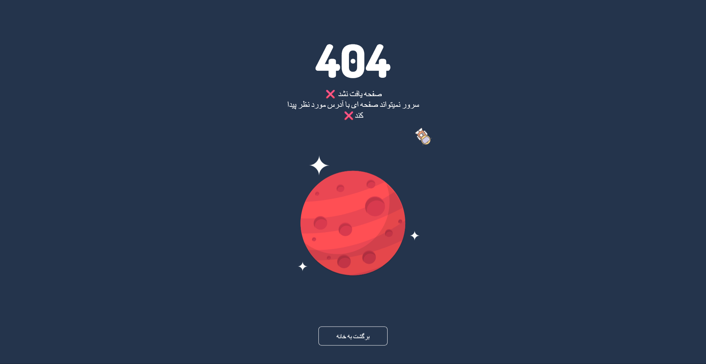
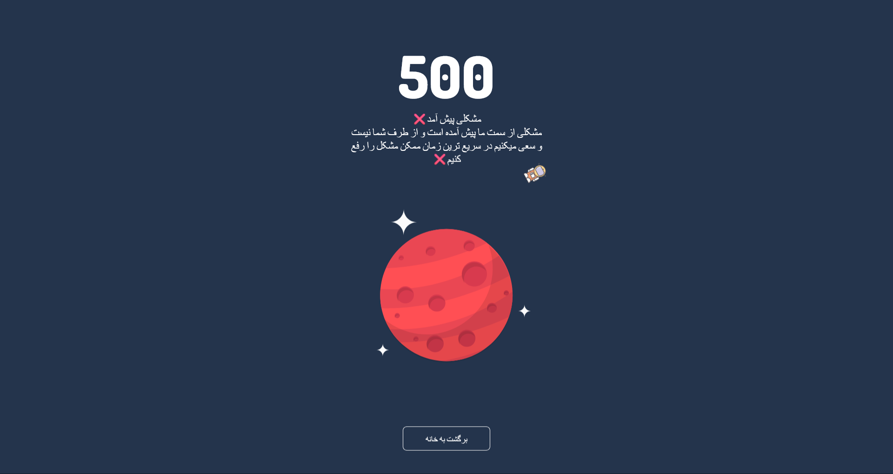

# Eror-Page 400


<!--Banner1-->



<!--Header Name-->
#  Interactive spider 
📌 Eror 400
Source Code
<br />


# ⭐ DEMO
### 　https://hosseinn-ab1.github.io/Eror-Page/Eror-400/index.html
<hr>
<br />

# Eror-Page 401


<!--Banner2-->


<!--Header Name-->
#  Interactive spider 
📌 Eror 401 
Source Code
<br />


# ⭐ DEMO
### 　https://hosseinn-ab1.github.io/Eror-Page/Eror-401/index.html
<hr>
<br />

# Eror-Page 403


<!--Banner3-->



<!--Header Name-->
#  Interactive spider 
📌 Eror 403
Source Code
<br />


# ⭐ DEMO
### 　https://hosseinn-ab1.github.io/Eror-Page/Eror-403/index.html
<hr>
<br />

# Eror-Page 404


<!--Banner4-->



<!--Header Name-->
#  Interactive spider 
📌 Eror 404
Source Code
<br />


# ⭐ DEMO
### 　https://hosseinn-ab1.github.io/Eror-Page/Eror-404/index.html
<hr>
<br />

# Eror-Page 500


<!--Banner5-->



<!--Header Name-->
#  Interactive spider 
📌 Eror 500
Source Code
<br />


# ⭐ DEMO
### 　https://hosseinn-ab1.github.io/Eror-Page/Eror-500/index.html
<hr>
<br />
<hr> <br />

###  A little more about me...  

```javascript
const HosseinAbbasi = {
  pronouns: "he" | "man",
  code: [Javascript, HTML, CSS, PHP, Python],
  tools: [React, Redux, Node, Storybook, Styled-Components, Django, Docker],
  architecture: ["microservices", "event-driven", "design system pattern"],

 challenge: "I am doing the #100DaysOfCode challenge focused on projrct and website design"
}
```
<hr>

<!--Contact Section--> 

<h2 align="center">🤝 Cᴏɴɴᴇᴄᴛ Wɪᴛʜ Mᴇ 🤝 </h2>
<div align="center">
  
<a href="mailto:basy16b84@gmail.com" target="_blank">

</a>

<a href="https://x.com/hosseinn_ab" target="_blank">

</a>

<a href="https://www.instagram.com/hosseinn_ab" target="_blank">

</a>

<a href="https://www.githubcom/hosseinn-ab1" target="_blank">

</a>

<a href="https://www.linkedin.com/in/hosseinn_ab/" target="_blank">

</a>
</div>
<br/>

<!--Buy me a coffee-->
<div align="center">
<a href="https://t.me/hosseinn_ab" target="_blank"></a>
</div>


<!--Footer--> 
<p align="center">
  
</p>


